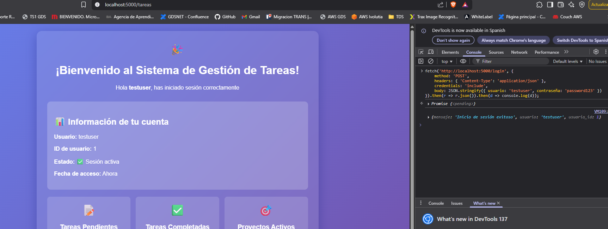
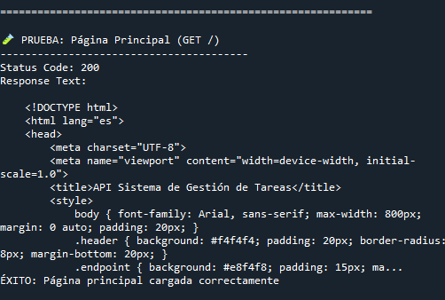
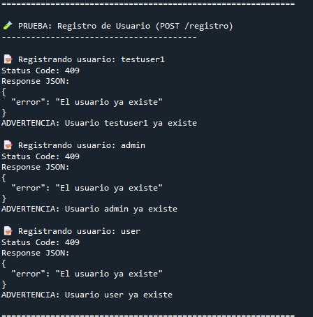
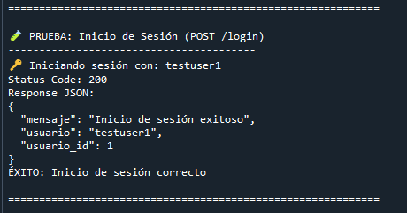
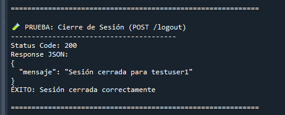
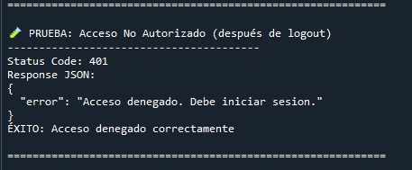

# Sistema de Gestión de Tareas - API Flask

**PFO 2 - PR: Sistema de Gestión de Tareas con API y Base de Datos**

## 📋 Descripción del Proyecto

Este proyecto implementa una API REST desarrollada con Flask que permite gestionar usuarios y tareas utilizando SQLite como base de datos. El sistema incluye autenticación básica con protección de contraseñas mediante hashing y una interfaz web para visualizar el estado del sistema.

## Características Principales

- 🔐 **Autenticación segura** con contraseñas hasheadas
- 🗄️ **Persistencia de datos** con SQLite
- 🌐 **API REST** con endpoints funcionales
- 🛡️ **Validación de datos** y manejo de errores
- 🍪 **Gestión de sesiones** para mantener estado de login

## 🛠️ Requisitos del Sistema

- Python 3.7+
- Flask
- SQLite3

## 📦 Instalación

### 1. Clonar el repositorio
```bash
git clone [URL_DEL_REPOSITORIO]
cd sistema-gestion-tareas
```

### 3. Instalar dependencias
```bash
pip install flask
```

### 4. Ejecutar la aplicación
```bash
python servidor.py
```

El servidor estará disponible en: `http://localhost:5000`

## 📡 Endpoints del API

### 🏠 Página Principal
- **URL**: `GET /`
- **Descripción**: Muestra la documentación del API y ejemplos de uso
- **Autenticación**: No requerida

### 👤 Registro de Usuario
- **URL**: `POST /registro`
- **Descripción**: Registra un nuevo usuario en el sistema
- **Autenticación**: No requerida

**Parámetros JSON:**
```json
{
    "usuario": "nombre_usuario",
    "contraseña": "contraseña_segura"
}
```

**Respuesta exitosa (201):**
```json
{
    "mensaje": "Usuario registrado exitosamente",
    "usuario_id": 1,
    "usuario": "nombre_usuario"
}
```

### 🔑 Inicio de Sesión
- **URL**: `POST /login`
- **Descripción**: Autentica un usuario y crea una sesión
- **Autenticación**: No requerida

**Parámetros JSON:**
```json
{
    "usuario": "nombre_usuario",
    "contraseña": "contraseña_segura"
}
```

**Respuesta exitosa (200):**
```json
{
    "mensaje": "Inicio de sesión exitoso",
    "usuario": "nombre_usuario",
    "usuario_id": 1
}
```

### 📋 Gestión de Tareas
- **URL**: `GET /tareas`
- **Descripción**: Muestra página de bienvenida con información del usuario
- **Autenticación**: Requerida

**Respuesta**: Página HTML con interfaz de usuario

### 🚪 Cerrar Sesión
- **URL**: `POST /logout`
- **Descripción**: Cierra la sesión del usuario actual
- **Autenticación**: Requerida

## 🧪 Instrucciones para Probar el Sistema

### Usando cURL (Terminal/Línea de comandos)

#### 1. Registrar un nuevo usuario
```bash
curl -X POST http://localhost:5000/registro \
  -H "Content-Type: application/json" \
  -d '{"usuario": "testuser", "contraseña": "password123"}'
```

#### 2. Iniciar sesión
```bash
curl -X POST http://localhost:5000/login \
  -H "Content-Type: application/json" \
  -d '{"usuario": "testuser", "contraseña": "password123"}' \
  -c cookies.txt
```

#### 3. Acceder a tareas (requiere login)
```bash
curl -X GET http://localhost:5000/tareas \
  -b cookies.txt
```

#### 4. Cerrar sesión
```bash
curl -X POST http://localhost:5000/logout \
  -H "Content-Type: application/json" \
  -b cookies.txt
```

### Usando Postman

1. **Configurar headers**: Agregar `Content-Type: application/json`
2. **Registrar usuario**: POST a `/registro` con JSON en el body
3. **Iniciar sesión**: POST a `/login` con credenciales
4. **Acceder a tareas**: GET a `/tareas` (automáticamente usa cookies de sesión)

### Usando el navegador web

1. Visitar `http://localhost:5000` para ver la documentación
2. Usar herramientas de desarrollador para hacer requests AJAX
3. O integrar con un frontend JavaScript/HTML

#### Ejemplo: login desde consola del navegador para poder acceder a /tareas



### Usando el script de tests 

```bash
python test_api.py
```

## Capturas de Pantalla

### Test sitio



### Test registro usuario



### Test login



### Test logout



### Test acceso no autorizado



## 🗄️ Estructura de la Base de Datos

### Tabla: usuarios
```sql
CREATE TABLE usuarios (
    id INTEGER PRIMARY KEY AUTOINCREMENT,
    usuario TEXT UNIQUE NOT NULL,
    contraseña_hash TEXT NOT NULL,
    fecha_registro TIMESTAMP DEFAULT CURRENT_TIMESTAMP
);
```

### Tabla: tareas (preparada para futuras expansiones)
```sql
CREATE TABLE tareas (
    id INTEGER PRIMARY KEY AUTOINCREMENT,
    usuario_id INTEGER,
    titulo TEXT NOT NULL,
    descripcion TEXT,
    completada BOOLEAN DEFAULT FALSE,
    fecha_creacion TIMESTAMP DEFAULT CURRENT_TIMESTAMP,
    FOREIGN KEY (usuario_id) REFERENCES usuarios (id)
);
```

## 🔒 Seguridad Implementada

- **Hashing de contraseñas**: Se utiliza SHA-256 con salt aleatorio
- **Validación de entrada**: Verificación de campos requeridos y longitudes mínimas
- **Protección de endpoints**: Decorador `@requiere_login` para rutas protegidas
- **Manejo de errores**: Respuestas apropiadas sin exponer información sensible

## 📂 Estructura del Proyecto

```
sistema-gestion-tareas/
│
├── servidor.py          # Código principal del servidor Flask
├── README.md           # Documentación del proyecto
├── tareas.db          # Base de datos SQLite (se crea automáticamente)
├── requirements.txt   # Dependencias del proyecto
└── screenshots/       # Capturas de pantalla de pruebas
```


## Solución de Problemas comunes

### Error: "Base de datos bloqueada"
- Asegúrate de que no hay múltiples instancias ejecutándose
- Verifica permisos de escritura en el directorio

### Error: "Módulo flask no encontrado"
```bash
pip install flask
```

### Error de conexión
- Verificar que el servidor esté ejecutándose en el puerto correcto
- Comprobar firewall/antivirus

## Respuestas Conceptuales

### ¿Por qué hashear contraseñas?

**El hashing de contraseñas es fundamental por las siguientes razones:**

1. **Seguridad**: Si la base de datos es comprometida, las contraseñas no están visibles en texto plano
2. **Irreversibilidad**: Los algoritmos de hash son funciones de una sola vía 
3. **Salting**: Al agregar un salt aleatorio, se previenen ataques de diccionario y rainbow tables
4. **Cumplimiento normativo**: Es una práctica estándar requerida por regulaciones de seguridad
5. **Protección del usuario**: Incluso los administradores del sistema no pueden conocer las contraseñas reales

**Implementación en el proyecto:**
- Utilizamos SHA-256 con salt aleatorio de 16 bytes
- Cada contraseña tiene un salt único
- El salt se almacena junto con el hash para verificación

### Ventajas de usar SQLite en este proyecto


1. **Simplicidad de despliegue**:
   - No requiere instalación de servidor de base de datos separado
   - Archivo único y portable
   - Configuración mínima requerida

2. **Rendimiento**:
   - Excelente para aplicaciones de pequeña a mediana escala
   - Operaciones de lectura muy rápidas
   - Bajo overhead de memoria

3. **Confiabilidad**:
   - Transacciones ACID completas
   - Manejo robusto de concurrencia
   - Resistente a corrupción de datos

4. **Facilidad de desarrollo**:
   - Incluido por defecto en Python
   - Sintaxis SQL estándar
   - Fácil respaldo y migración

5. **Costo**:
   - Completamente gratuito
   - Sin licencias o restricciones
   - Ideal para prototipos y MVPs


## 👨‍💻 Autor

Ciro Villasanti

